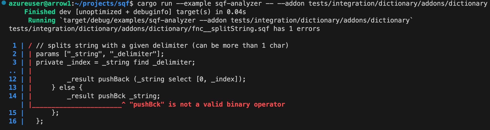

# SQF analyzer

This repository contains a Rust library to analyze SQF, a popular programming language to
mod Arma (computer game) series.



See [sql-analyzer-lsp](https://github.com/sqf-analyzer/sql-analyzer-lsp) for its addon for VS code.

## How to use

```bash
cargo run --example sqf-analyzer -- --addon <path to directory with config.cpp>
cargo run --example sqf-analyzer -- --file <path to sqf file>
```

## Features

### Full support for evaluating preprocessor

The analyzer fully supports preprocessor and the SQF. For example, it fully supports constructs such
as

```sqf
if a then {
    b
#ifdef A
};
#else
} else {
    c
};
#endif
d
```

and

```sqf
#define DOUBLES(var1,var2) ##var1##_##var2
#define QUOTE(var1) #var1
#define NAME(func) QUOTE(a\DOUBLES(fnc,func).sqf)

a = NAME(a)
```

This analyzer is tested on the complete source code of the
[official Antistasi](https://github.com/official-antistasi-community/A3-Antistasi) and has a code coverage of around 90%.

### Error locations

This analyzer tracks each token's location in the original file _before_ preprocessing and every
error message carries its location in the file.

### Support for `CfgFunctions` in `config.cpp`

This analyzer can to process the `CfgFunctions` (including preprocessor), resulting
in being able to introspect an addon and therefore resolve its functions and file locations.

### Symbolic evaluation

This analyzer has the complete set of operators supported by Arma 3 and will interpret the code
accordingly. For example, it can identify errors such as

```sqf
params [[\"_a\", true, [true]]]

private _b = _a + 1;
```

(`_a` is a boolean, 1 is a number, which cannot be added).

### Type inference

This analyzer is able to process SQF and infer types of variables,
as well as understanding the origin of the type.

## How to develop

1. [Install Rust's cargo](https://doc.rust-lang.org/cargo/getting-started/installation.html)
2. git clone this repository and cd to it
3. `cargo test`
4. `cargo tarpaulin --skip-clean --target-dir target/tarpaulin --out Lcov` for code coverage

Check [src/README.md](./src/README.md) for an overview of the design.

### How to generate the database

The database of operators is stored at `src/database.rs` and can be generated as follows:

Execute this command on the latest Arma 3

```sqf
_allCommands = [];
supportInfo "" apply {
	_x splitString ":" params ["_t", "_x"];
	if (_t != "t") then {
		_x = _x splitString " ";
		_command = switch count _x do {
			case 1;
			case 2: { _x # 0 };
			case 3: { _x # 1 };
			default {nil};
		};
		_allCommands pushBackUnique _command;
	};
};
_allCommands sort true;
_allCommands = _allCommands apply {
	supportInfo format["i:%1", _x]
};
_allCommands;
```

and copy-paste it to a file `supportinfo.txt` without any modification.

Finally, run

```bash
git restore src/database.rs && cargo run --example support_info
```

(the git restore is used so that if the generation produces incorrect Rust code, it still fail to run the second time).

NOTE: `handgunmagazine` return type is set to `String`, but it should be `Array`.
